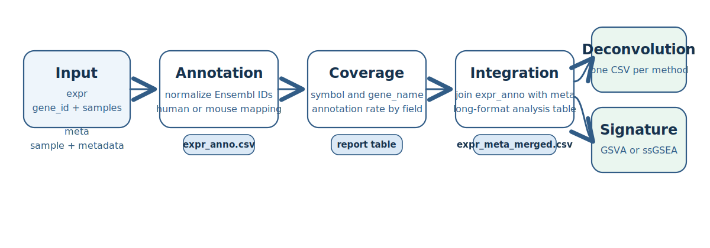

# expranno 

[](https://dai540.github.io/expranno/)
[](https://github.com/dai540/expranno/actions/workflows/R-CMD-check.yaml)
[](https://github.com/dai540/expranno/releases)
[](LICENSE)

`expranno` is an R package for downstream RNA-seq workflows built around
Ensembl-ID expression matrices and sample metadata. It standardizes four
core steps:

<https://dai540.github.io/expranno/>

- `annotate_expr()` for human or mouse gene annotation
- `merge_expr_meta()` for stable expression-metadata integration
- `run_cell_deconvolution()` for `immunedeconv`-based deconvolution
- `run_signature_analysis()` for GSVA or ssGSEA signature scoring

The package is intentionally narrow. It does not handle alignment,
quantification, QC, or differential expression. Instead, it standardizes
annotation presets, validation tables, provenance files, and downstream
outputs once an expression matrix already exists.

It is designed for analysts working with bulk RNA-seq matrices where:

- `expr`: first column is `gene_id`, remaining columns are samples
- `meta`: first column is `sample`

For repeatable annotation, `expranno` ships fixed presets such as
`human_tpm_v102` and `mouse_tpm_v102`, plus bundled truth tables through
`example_annotation_truth()`.



## Installation

Install from GitHub:

```r
install.packages("pak")
pak::pak("dai540/expranno")
```

Or:

```r
install.packages("remotes")
remotes::install_github("dai540/expranno")
```

Or install from a source tarball:

```r
install.packages("path/to/expranno_<version>.tar.gz", repos = NULL, type = "source")
```

Optional annotation and signature backends:

```r
BiocManager::install(c(
  "biomaRt",
  "AnnotationDbi",
  "org.Hs.eg.db",
  "org.Mm.eg.db",
  "ensembldb",
  "EnsDb.Hsapiens.v86",
  "EnsDb.Mmusculus.v79",
  "GSVA"
))
```

Optional deconvolution backend:

```r
remotes::install_github("omnideconv/immunedeconv")
```

Then load the package:

```r
library(expranno)
```

## Citation

If you use `expranno`, cite the package as:

> Dai (2026). *expranno: Expression Annotation, Metadata Integration,
> Deconvolution, and Signature Analysis*. R package.
> <https://dai540.github.io/expranno/>

You can also retrieve the citation from R:

```r
citation("expranno")
```

## What expranno does

`expranno` does four things.

- Annotates Ensembl IDs with fixed-release human or mouse presets
- Benchmarks and validates annotation against truth tables
- Merges annotated expression with metadata into stable CSV outputs
- Runs deconvolution and signature scoring from the same annotated matrix

In practice, the package is doing this:

- `annotate_expr()` writes `expr_anno.csv` plus coverage, ambiguity, and provenance tables
- `validate_annotation_engines()` compares predicted fields against truth tables
- `merge_expr_meta()` writes `expr_meta_merged.csv`
- `run_cell_deconvolution()` writes `cell_deconv_<method>.csv`
- `run_signature_analysis()` writes `signature_gsva.csv` and `signature_ssgsea.csv`
- `run_expranno()` orchestrates the full workflow and keeps the output layout stable

## Main functions

- `run_expranno()`
- `annotate_expr()`
- `benchmark_annotation_engines()`
- `validate_annotation_engines()`
- `merge_expr_meta()`
- `run_cell_deconvolution()`
- `run_signature_analysis()`
- `as_expranno_input()`
- `as_expranno_se()`
- `list_annotation_presets()`
- `example_annotation_truth()`

## Stable outputs

- `expr_anno.csv`
- `annotation_report.csv`
- `annotation_ambiguity.csv`
- `annotation_provenance.csv`
- `annotation_validation_summary.csv`
- `annotation_validation_detail.csv`
- `expr_meta_merged.csv`
- `cell_deconv_<method>.csv`
- `signature_gsva.csv`
- `signature_ssgsea.csv`
- `session_info.txt`

## Example

```r
library(expranno)

demo <- example_expranno_data()

result <- run_expranno(
  expr = demo$expr,
  meta = demo$meta,
  annotation_preset = "human_tpm_v102",
  expr_scale = "abundance",
  duplicate_strategy = "mean",
  output_dir = tempdir(),
  run_deconvolution = FALSE,
  run_signature = FALSE
)

result$annotation$report
```

## Tutorials

The tutorial site is organized around:

- `Getting Started`
- preset reference
- benchmarking and reproducibility
- human case study
- mouse case study
- function reference

## What expranno cannot do yet

- It does not perform alignment, quantification, or read-level QC
- It does not replace native `immunedeconv` or `GSVA` method-specific tuning
- It does not provide a CRAN or Bioconductor release yet
- It does not implement a full reporting layer beyond CSV outputs, vignettes, and pkgdown docs

## Package layout

- `R/annotate.R`: annotation workflows and backends
- `R/run.R`: end-to-end wrapper
- `R/signature.R`: GSVA and ssGSEA scoring
- `R/deconvolution.R`: deconvolution wrapper
- `R/validation.R`: benchmark and truth-table validation
- `R/interop.R`: Bioconductor input coercion
- `R/bioc-output.R`: Bioconductor output conversion
- `vignettes/`: getting-started, design, and case-study articles
- `inst/extdata/`: bundled demo GMT and truth tables
