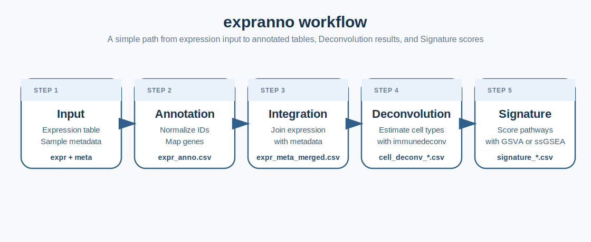

# expranno



`expranno` is an R package for RNA-seq workflows that start from an
expression matrix and sample metadata, then move through gene
annotation, metadata integration, immune deconvolution, and signature
scoring.

The package is designed for human and mouse expression matrices where:

- the first column of `expr` is `gene_id`
- the remaining columns of `expr` are samples
- the first column of `meta` is `sample`

`expranno` is built around four jobs:

- gene annotation from Ensembl IDs
- expression and metadata integration
- immune deconvolution with `immunedeconv`
- signature scoring with GSVA or ssGSEA

Rather than forcing a single annotation backend, `expranno` uses a
coverage-first strategy that can combine:

- `biomaRt`
- `org.Hs.eg.db` or `org.Mm.eg.db`
- optional `EnsDb` packages

This makes it possible to recover more symbols, names, and identifiers
than a single-source annotation pass.

`expranno` does this in a simple analysis sequence:

1.  validate `expr` and `meta`
2.  annotate genes and write `expr_anno.csv`
3.  merge expression and metadata into `expr_meta_merged.csv`
4.  run immune deconvolution and save one table per method
5.  run GSVA or ssGSEA and save one score table per method

  

## Installation

Local install:

``` r
# install.packages("pak")
# pak::pak("path/to/expranno")
```

Optional backends:

``` r
BiocManager::install(c(
  "biomaRt",
  "AnnotationDbi",
  "org.Hs.eg.db",
  "org.Mm.eg.db",
  "ensembldb",
  "EnsDb.Hsapiens.v86",
  "EnsDb.Mmusculus.v79",
  "immunedeconv",
  "GSVA"
))
```

## Workflow Overview

The main wrapper is
[`run_expranno()`](https://example.com/expranno/reference/run_expranno.md).
It orchestrates the whole pipeline from raw inputs to saved outputs.

``` r
result <- expranno::run_expranno(
  expr = expr,
  meta = meta,
  species = "human",
  annotation_engine = "hybrid",
  output_dir = "results",
  run_deconvolution = TRUE,
  run_signature = TRUE,
  geneset_file = "hallmark.gmt",
  signature_method = "both"
)
```

## Input Contract

`expr` must be a gene-by-sample table.

``` r
head(demo$expr)
```

| gene_id            | sample_a | sample_b |
|--------------------|---------:|---------:|
| ENSG00000141510.17 |      120 |      140 |
| ENSG00000146648.18 |       80 |       77 |

`meta` must be a sample metadata table.

``` r
head(demo$meta)
```

| sample   | group   | batch |
|----------|---------|-------|
| sample_a | case    | b1    |
| sample_b | control | b1    |

## Core Functions

`expranno` is intentionally split into one end-to-end wrapper and four
stepwise building blocks.

- [`run_expranno()`](https://example.com/expranno/reference/run_expranno.md)
- [`annotate_expr()`](https://example.com/expranno/reference/annotate_expr.md)
- [`merge_expr_meta()`](https://example.com/expranno/reference/merge_expr_meta.md)
- [`run_cell_deconvolution()`](https://example.com/expranno/reference/run_cell_deconvolution.md)
- [`run_signature_analysis()`](https://example.com/expranno/reference/run_signature_analysis.md)

## Minimal Example

``` r
demo <- expranno::example_expranno_data()

res <- expranno::run_expranno(
  expr = demo$expr,
  meta = demo$meta,
  species = "human",
  annotation_engine = "none",
  output_dir = tempdir(),
  run_deconvolution = FALSE,
  run_signature = FALSE
)
```

## Main Outputs

`expranno` is designed to write analysis-ready CSV files with stable
names.

- `expr_anno.csv`
- `expr_meta_merged.csv`
- `cell_deconv_<method>.csv`
- `signature_gsva.csv`
- `signature_ssgsea.csv`

The high-level wrapper is
[`run_expranno()`](https://example.com/expranno/reference/run_expranno.md),
but the package also exposes smaller steps:

- [`annotate_expr()`](https://example.com/expranno/reference/annotate_expr.md)
- [`merge_expr_meta()`](https://example.com/expranno/reference/merge_expr_meta.md)
- [`run_cell_deconvolution()`](https://example.com/expranno/reference/run_cell_deconvolution.md)
- [`run_signature_analysis()`](https://example.com/expranno/reference/run_signature_analysis.md)

## Documentation

The package website includes:

- a getting started article
- a step-by-step case study tutorial
- a theory and design article
- a function reference
